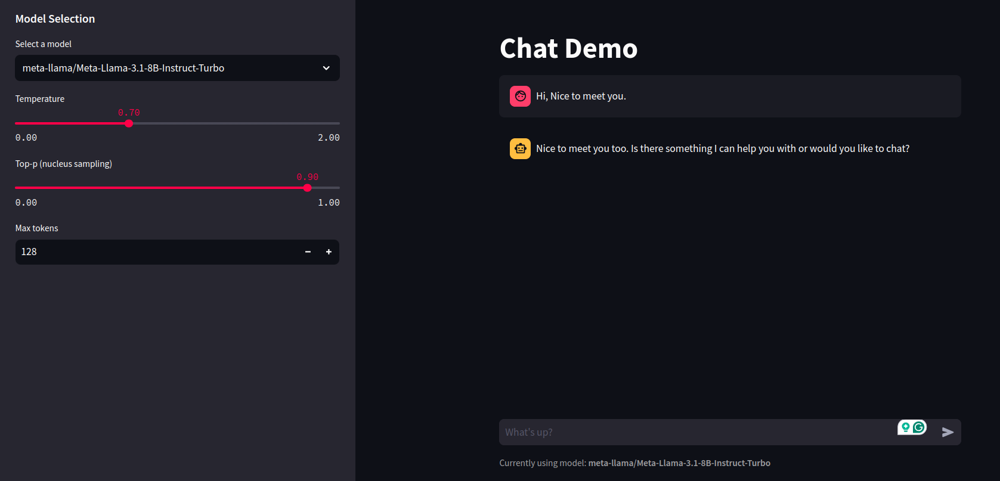

# LLM Application Demos

A collection of LLM-based applications for exploration and learning.

## Applications

### 1. Chat Demo
An interactive chat interface using various LLM models through Together.ai API.

Features:
- Multiple model options (Llama, Gemma, Mistral, Qwen)
- Adjustable parameters (temperature, top-p, max tokens)
- Real-time streaming responses

Example:


### 2. Attention Visualization
A tool to visualize attention patterns in transformer-based language models.

Features:
- Support for multiple transformer-based model variants (currently only tested on gpt-2, but should work fine for other models).
- Layer-by-layer attention visualization
- Aggregated attention patterns
- Interactive heatmaps

Example:


## Setup

```bash
conda env create -f environment.yaml
```

## Suggestion

Welcome to any type of suggestion.
